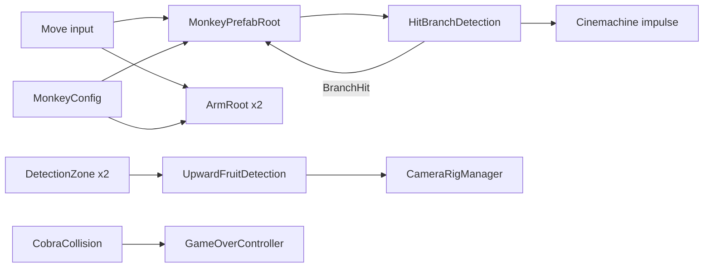

# Monkobra CONTEXT

## Project Overview

Monkobra is a 3D vertical upward-scrolling game: a monkey climbs a tall tree, chased by a cobra, and grabs bananas to restore stamina. It descends from a paired prototype (`kami-lel/usc-csci-526-paired-prototype`).

| Aspect | Value |
| --- | --- |
| Engine | Unity 6 (`6000.3.22f1`), URP |
| Packages in play | Input System, Cinemachine (camera views, impulse shake), uGUI |
| Genre | 3D obstacle-running (*Temple Run 2*, *Subway Surfers*, *Minion Rush*) |
| Course | USC CSCI-526, Fall 2026 |
| Team | Yuqing Lu, Yangyi Lu (Erik) |

## Repository Layout

```text
monkobra/
├── README.md          human onboarding
├── AGENTS.md          agent rules
├── CONTEXT.md         this file
├── CHANGELOG.md       version history, plus open triage tags in a comment
├── Assets/
│   ├── _Monkobra/     all authored assets, <Type>/<Module>/<asset>
│   │   ├── Scenes/    Lv1Scene (main), CobraDemo (standalone cobra test)
│   │   ├── Scripts/   Cobra/, Environment/, Player/, UI/, GameController
│   │   ├── Prefabs/   Monkey, Environment/ (tree, branch), UI/StaminaBar
│   │   ├── Material/  Environment/, Player/
│   │   └── Settings/_Shared/  URP assets, input actions
│   └── Readme.asset   Unity template leftover
├── Packages/          manifest & lock
└── ProjectSettings/   Unity project settings
```

The repository root is the Unity project root. `Library/`, `Temp/`, `Logs/`, `UserSettings/`, `*.csproj`, and `*.slnx` are ignored.

## Gameplay Model

| Element | Behavior | Status |
| --- | --- | --- |
| Monkey | kinematic body: vertical input ramps a climb speed along world Y, horizontal input orbits the trunk at a fixed radius | implemented |
| Arms | `ArmRoot` drives a `ConfigurableJoint` per arm: an alternating hand-over-hand stroke while move input is held, or a reach that locks its aim at press and only stretches, with the hand reporting its own contacts | implemented |
| Tree | stack of static and dynamic trunk segments under a `TreeTop`, each dynamic segment decorated with branches | implemented, finite height |
| Branch hit | camera shake, then stun (input ignored) while the monkey drops a set distance, all tuned in `MonkeyConfig` | implemented |
| Cobra | orbits and climbs the trunk on its own, trigger contact shows the game-over panel | implemented |
| Stamina | `StaminaBar` slider drains on a timer, `AddStamina` restores it, budget and drain rate come from `GameConfig` | bar exists, not yet tied to hits or grabs |
| Grab | hold the interact action: camera swaps to a side view and the arm stretches toward the newest fruit at `ReachExtendSpeedU`; release grabs it iff the hand collider overlaps the fruit at that instant, else a miss (too short, or stretched past it) | grab implemented, the fruit is switched off, stamina not yet restored |
| Win, lose | `GameController.WinGame` and `LoseGame` end the run once | screens are stubs |



## Systems & Key Scripts

All under `Assets/_Monkobra/Scripts/`.

| Script | Role |
| --- | --- |
| `GameController` | scene singleton (`Instance`), owns the win or lose end state |
| `GameConfig` | ScriptableObject of game-wide tuning: max stamina, drain amount and interval. Asset at `Settings/_Shared/GameConfig.asset`, read by `StaminaBar` |
| `Environment/TreeManager` | singleton (`I`) exposing tree `MinY`, `MaxY` for height-to-progress mapping |
| `Environment/DynamicTreeSegmentPrefabRoot` | on `Start`, places Branch With Fruit prefabs on itself, count scaled by climb progress |
| `Environment/BranchFruitPlacementConfig` | ScriptableObject of shared placement tuning: branch counts, radius, separation, retry cap |
| `Environment/BranchWithScriptRoot` | decides per branch whether it bears a banana, then shows or hides the fruit children |
| `Player/MonkeyPrefabRoot` | movement, branch-hit stun and drop |
| `Player/ArmRoot` | one arm's Rigidbody and `ConfigurableJoint`, sitting at the hand end: climbs a stroke cycle on move input, or on interact locks its aim at the newest fruit and stretches out, grabbing on release iff the hand overlaps the fruit. Reports the hand's live contacts. Writes only the joint's drive targets, never its configuration |
| `Player/MonkeyConfig` | ScriptableObject of all shared monkey tuning: arm stroke, reach speed, climb and orbit speeds, branch-hit stun, and the move and interact actions the body and arms read |
| `Player/HitBranchDetection` | trigger on tag `Branch`, raises `BranchHit`, fires the camera impulse |
| `Player/UpwardFruitDetection` | singleton (`I`), `ReachForLeft` and `ReachForRight` from tag `FruitCollider` overlaps |
| `Player/DetectionZone` | side-tagged trigger volume that forwards enter and exit events |
| `Player/CameraRigManager` | swaps behind, look-left, look-right cameras by Cinemachine priority |
| `Cobra/CobraClimb` | spiral path around `pathCenter`, body segments trail the head |
| `Cobra/CobraCollisions` | trigger enter calls `GameOverController` |
| `UI/StaminaBar`, `UI/ProgressBarRoot`, `UI/GameOverController` | stamina slider, player-height progress scrollbar, game-over panel |

## Patterns & Conventions

- Singletons are scene-scoped and self-destroy the duplicate component only: `GameController.Instance`, `TreeManager.I`, `UpwardFruitDetection.I`
- A consumer that may start before its singleton reads it in `Start`, not `Awake`, so Awake order never matters
- Nothing about the monkey is mass or gravity driven: the body is kinematic and `MonkeyPrefabRoot` writes its position and rotation outright, so no arm joint or collision can move it, while each `ArmRoot` is posed purely by its joint drives, forces gravity off on its own Rigidbody, and ignores collisions with the body's colliders so a hand never reports the monkey itself
- Detection scripts forward trigger events (`Entered`, `Exited`, `BranchHit`) rather than calling their consumers directly
- Trigger matching relies on tags: `Branch`, `FruitCollider`
- Input arrives through `InputActionReference` fields, each script enables and disables its own action, and the arms take theirs from `MonkeyConfig` so both read one action
- Scripts guard required inspector fields in `Awake` with a logged error naming the field
- Tuning values stay in serialized fields, and shared tuning sits in a ScriptableObject: `MonkeyPrefabRoot` and `ArmRoot` hold only wiring references and which side an arm is, every number and the input action come from `MonkeyConfig`, while game-wide numbers such as stamina come from `GameConfig`
- Two coding styles coexist: the newer scripts (`Environment/`, `Player/`, `GameController`) follow the house Unity style, while `Cobra/` and `UI/StaminaBar`, `UI/GameOverController` are older contributions still in the template style
- The core tension is escape vs. sustain: grabbing slows the monkey's reactions, so every pickup risks a branch or cobra collision

## Known Gaps & Constraints

- No tests, build, or run commands exist: verification means opening `Lv1Scene` in the Editor
- A grabbed banana is only switched off: nothing calls `StaminaBar.AddStamina` yet
- Stamina drains on a timer only: it is not linked to climb speed, branch hits, or a stamina-out lose condition
- `GameController` win and lose screens are stubs, and the cobra path uses `GameOverController` instead of `LoseGame`
- `CobraDemo` scene remains next to `Lv1Scene`, while recent history says the demo was merged into `Lv1Scene`
- The tree is finite (`TreeManager` min and max y), not the endless tree of the pitch
- Difficulty does not scale with distance yet, apart from branch count per segment
- The prototype's WebGL link, gameplay video, and contributions belong to a different team's submission and do not describe this repository

## Living Document Maintenance

Update this file in the same change that adds entities, systems, or mechanics, or shifts boundaries or workflows. The assistant that made the change writes the update as its final step, and the file stays on the pull-request checklist.
