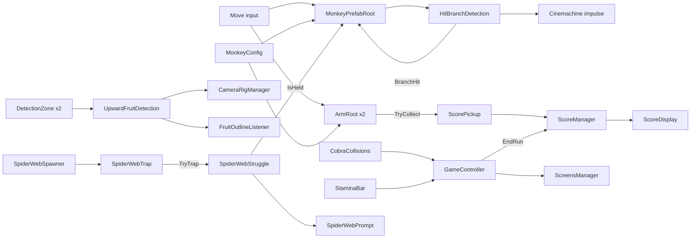

# Monkobra CONTEXT

Descriptive knowledge of this repository for agents and developers.

- Belongs Here: what the system is, ie architecture, domain model, API surface, patterns, known gaps; only what the code cannot show, as it stands, never its history
- Size: stay lean for the context window; when the file grows, move detail to `docs/` or cut it
- Upkeep: update in the same change that moves architecture, patterns, commands, or environment variables
- Structure: follow the existing sections; keep every statement true for every contributor
- Belongs in `AGENTS.md`: prescriptive rules for agents, ie commands, conventions, constraints, do/don't
- Belongs in `docs/`: system documentation for users and agents alike; link it from here, never grow this file to hold it
- Local Layer: put machine-specific or personal context in `CONTEXT.local.md`; create it if missing, never commit it

## Project Overview

Game concept, genre, twist, and design intent are in the [Game Design Document](docs/monkobra-gdd.md), the build in the [Technical Design Document](docs/monkobra-tdd.md), the hazards in [Mobs](docs/mob-doc.md), and reaching in the [Grab System](docs/grab-doc.md). The project descends from a paired prototype (`kami-lel/usc-csci-526-paired-prototype`).

| Aspect | Value |
| --- | --- |
| Engine | Unity 6 (`6000.3.22f1`), URP 17.3.0 |
| Packages in play | Input System 1.20.0, Cinemachine 3.1.7 (camera views, impulse shake), uGUI 2.0.0 with TextMesh Pro |
| Course | USC CSCI-526, Fall 2026 |

## Repository Layout

```text
monkobra/
├── README.md          human onboarding
├── AGENTS.md          agent rules
├── CONTEXT.md         this file
├── CHANGELOG.md       version history, plus open triage tags in a comment
├── docs/              monkobra-gdd.md (design intent), monkobra-tdd.md (technical design), mob-doc.md (cobras, branches, webs), grab-doc.md (grab system)
├── Assets/
│   ├── _Monkobra/     all authored assets, <Type>/<Module>/<asset>
│   │   ├── Scenes/    Lv1Scene (main), CobraDemo, FallingCobraDemo, WebDemo (tests)
│   │   ├── Scripts/   ArmRoot/ (monkey body, arms, fruit detection, camera rig), Cobra/, Environment/, Scoring/, UI/, GameController, GameConfig
│   │   ├── Prefabs/   Player/ (Monkey, Arm), Cobra/ (FallingCobra), Environment/ (tree top and segments, branch, spider web), UI/StaminaBar
│   │   ├── Material/  Environment/, Player/
│   │   ├── Shaders/   Environment/FruitOutline (inverted-hull Shader Graph)
│   │   └── Settings/  tuning assets (MonkeyConfig, GameConfig, BranchFruitPlacementConfig), Scoring/ (ScoreConfig, BananaScore), _Shared/ URP assets
│   ├── TextMesh Pro/  imported TMP essentials, not authored
│   └── Readme.asset   Unity template leftover
├── Monkobra/          committed WebGL export served by GitHub Pages
├── Packages/          manifest & lock
└── ProjectSettings/   Unity project settings
```

The repository root is the Unity project root. `Library/`, `Temp/`, `Logs/`, `UserSettings/`, `*.csproj`, and `*.slnx` are ignored.

## Gameplay Model

| Element | Behavior | Status |
| --- | --- | --- |
| Monkey | kinematic body: vertical input ramps a climb speed along world Y, horizontal input orbits the trunk at a fixed radius | implemented |
| Arms | `ArmRoot` drives a `ConfigurableJoint` per arm: an alternating hand-over-hand stroke while move input is held, or a reach that locks its aim at press and only stretches, with the hand reporting its own contacts | implemented |
| Tree | stack of static and dynamic trunk segments under a `TreeTop`, each dynamic segment decorated with branches | implemented, finite height |
| Branch hit | camera shake, then stun (input ignored) while the monkey drops a set distance, all tuned in `MonkeyConfig` | implemented |
| Cobra | orbits and climbs the trunk on its own, coiling at least one full loop round it as a corkscrew; any trigger contact, side-on or by dropping onto the coil, calls `GameController.LoseGame` | implemented |
| Falling cobra | in `FallingCobraDemo`, unlocks after a configured climb distance from the monkey's starting height, then periodically spawns from a nearby branch above the player, flashes a warning, and falls; its single `Branch` trigger causes the existing camera shake, stun and drop instead of ending the run | demo only; not in `Lv1Scene` |
| Stamina | `StaminaBar` slider drains on a timer and by movement (`MonkeyPrefabRoot` calls `DrainByMovement` each step: climbing costs most, orbiting less, descending and the stun fall nothing), `AddStaminaByFruit` restores a fixed amount, budget, rates and fruit restore come from `GameConfig` | grabs restore it, not yet tied to hits |
| Grab | hold the interact action: camera swaps to a side view and the arm stretches toward the newest fruit at `ReachExtendSpeedU`; release grabs it iff the hand collider overlaps the fruit at that instant, else a miss (too short, or stretched past it). Fruit in a detection zone is outlined as reachable, fruit under the hand as grabbable | grab implemented: `ScorePickup.TryCollect` switches the fruit off and adds its points (a fruit without one is just switched off), then `ArmRoot` calls `StaminaBar.I.AddStaminaByFruit` |
| Spider web | `SpiderWebSpawner` sticks webs flat on the trunk from `startProgress` of the climb up, clear of branches and fruit. The monkey's solid body touching a web's trigger holds it in place (`MonkeyPrefabRoot.IsHeld`) and pauses interact; each Jump (Space) press fills an escape bar that drains while idle, a full bar removes the web and grants a short immunity. `SpiderWebPrompt` shows the hint on the first trap per scene load, the bar on every trap, and hides both on escape or game over. The struggle freezes while paused or after game over | implemented in `Lv1Scene` and `WebDemo` |
| Win, lose | `GameController.WinGame` and `LoseGame` end the run once: `ScoreManager.EndRun` settles the score, `ScreensManager` shows the win or lose panel and time freezes. Triggers: win zone (`WinZoneHandler`, `MonkeyPrefabRoot`), cobra contact, stamina at 0 | implemented |
| Score | `ScoreManager` sums a distance score, whole meters of the highest point climbed times `PointsPerMeter` from `ScoreConfig`, and a reward score from each fruit collected through its `ScorePickup` (`ScoreReward` points). Scoring stops on pause, game over, or `EndRun`; `ScoreDisplay` shows the total on the HUD and on both end panels | implemented in `Lv1Scene` |



## Systems & Key Scripts

All under `Assets/_Monkobra/Scripts/`.

| Script | Role |
| --- | --- |
| `GameController` | scene singleton (`I`), owns the win or lose end state and exposes it as `IsGameOver`, ends the score run, freezes time |
| `GameConfig` | ScriptableObject of game-wide tuning: max stamina, drain amount and interval, stamina per fruit, stamina per unit climbed and per unit orbited. Asset at `Settings/GameConfig.asset`, read by `StaminaBar` |
| `Environment/TreeManager` | singleton (`I`) exposing tree `MinY`, `MaxY` for height-to-progress mapping |
| `Environment/DynamicTreeSegmentPrefabRoot` | on `Start`, places Branch With Fruit prefabs on itself, count scaled by climb progress |
| `Environment/BranchFruitPlacementConfig` | ScriptableObject of shared placement tuning: branch counts, radius, separation, retry cap. Asset at `Settings/` |
| `Environment/BranchWithScriptRoot` | decides per branch whether it bears a banana, then shows or hides the fruit children |
| `ArmRoot/MonkeyPrefabRoot` | movement, branch-hit stun and drop, `IsHeld` freezes the body in place |
| `ArmRoot/ArmRoot` | one arm's Rigidbody and `ConfigurableJoint`, sitting at the hand end: climbs a stroke cycle on move input, or on interact locks its aim at the newest fruit and stretches out, grabbing on release iff the hand overlaps the fruit. Reports the hand's live contacts and, while reaching, the fruit under the hand as grabbable. Writes only the joint's drive targets, never its configuration |
| `ArmRoot/MonkeyConfig` | ScriptableObject of all shared monkey tuning: arm stroke, reach speed, climb and orbit speeds, branch-hit stun, and the move and interact actions the body and arms read |
| `ArmRoot/HitBranchDetection` | trigger on tag `Branch`, raises `BranchHit`, fires the camera impulse |
| `ArmRoot/UpwardFruitDetection` | singleton (`I`), `ReachForLeft` and `ReachForRight` from tag `FruitCollider` overlaps, plus the `FruitReachChanged` event and `IsFruitInReach` (fruit in either zone), and `GrabbableFruit` (the fruit a hand overlaps, set by `ArmRoot`) with its `GrabbableFruitChanged` event |
| `Environment/FruitOutlineListener` | on a banana's `FruitCollider` object: outlines its child meshes in 2 tiers by adding an outline material slot, reachable while the fruit sits in a detection zone and grabbable (wins) while a hand overlaps it so a release would grab it. Both materials use `Shaders/Environment/FruitOutline`, an inverted-hull Shader Graph |
| `ArmRoot/DetectionZone` | side-tagged trigger volume that forwards enter and exit events |
| `ArmRoot/CameraRigManager` | swaps behind, look-left, look-right cameras by Cinemachine priority |
| `Cobra/FallingCobraSpawner` | in `FallingCobraDemo`, permanently unlocks after the monkey climbs a configured distance above its starting height; tracks peak climb so spawn intervals gradually shorten to a configured floor even if the monkey later falls, while spawning one cobra at a time from a nearby branch above the player |
| `Cobra/FallingCobra` | flashes before falling; disables segment colliders and uses one capsule trigger tagged `Branch` so `HitBranchDetection` applies the existing drop penalty once |
| `Cobra/CobraClimb` | corkscrew path around `pathCenter`: the body spans `coilTurns` (≥ 1) loops rising `coilPitchU` per loop, and on `Awake` clones the last segment until no gap along the coil exceeds `maxSegmentGapU`. The cobra climbs nonstop and never descends (only slowing as the coil nears the player), so it runs on into the monkey, and a monkey moving or dropping down runs into the coil. Looks are code-only, no art assets: a chain of rounded beads with small gaps (`segmentFill`), slightly tapered by `thicknessProfile`, while each bead's capsule collider is stretched to reach its neighbours so the hit shape stays gapless; head flattened with primitive-sphere eyes, raised neck, a slow travelling slither wave; the body keeps its material's color, only the eyes are tinted black via `MaterialPropertyBlock` |
| `Cobra/CobraCollisions` | on the cobra root beside its kinematic Rigidbody, so every segment's trigger reports to it; contact with any monkey part (body and tail under the `Player`-tagged root, or a hand under `ArmRoot`) calls `GameController.LoseGame`, while the monkey's detection triggers are ignored |
| `UI/StaminaBar` | singleton (`I`), slider drained on a timer and by `DrainByMovement`, loses the game at 0, `AddStaminaByFruit` restores it on a grab |
| `Environment/SpiderWebSpawner` | on the tree root, after default execution order: rolls web slots per `DynamicTreeSegment` below it, lays each web flat on its segment's bark facing out, and drops spots below the start height, near another web, or whose trigger overlaps a branch or fruit. `PopulateSegment` decorates a segment added later |
| `Environment/SpiderWebTrap` | web prefab root, 1 trigger `BoxCollider` deepened outward along local +X to reach the monkey; hands itself to the `SpiderWebStruggle` on a touching solid collider's Rigidbody, pulses on escape presses, `Release` destroys it |
| `Environment/SpiderWebStruggle` | on the monkey root: trap state, escape progress and decay, post-escape protection, `Trapped`, `ProgressChanged`, `Escaped` events. Holds the body via `IsHeld` and disables interact from trap until protection ends |
| `Environment/SpiderWebBuilder` | MonoBehaviour with a `Build Web` context menu that builds the web prefab's strands out of thin cubes; a one-off authoring aid, not used at runtime |
| `Environment/WinZoneHandler` | on the `TreeTop` prefab: trigger that calls `GameController.WinGame` when the `Player`-tagged monkey enters |
| `UI/ScreensManager` | singleton (`I`), shows the win or lose panel |
| `UI/ProgressBarRoot` | player-height progress scrollbar |
| `UI/SpiderWebPrompt` | on an always-active Canvas child, shows the first-trap hint and the escape bar from `SpiderWebStruggle` events, hides both once `GameController.IsGameOver` |
| `Scoring/ScoreManager` | singleton (`I`), on `GameController`: tracks the distance and reward scores, raises `ScoreChanged`, `CanScore` gates scoring, `EndRun` settles it |
| `Scoring/ScoreConfig` | ScriptableObject of score rules: points per meter, world units per meter. Asset at `Settings/Scoring/ScoreConfig.asset` |
| `Scoring/ScorePickup` | on a fruit: `TryCollect` hands its `ScoreReward` to `ScoreManager` once and switches the fruit off |
| `Scoring/ScoreReward` | ScriptableObject of one pickup's points. Asset at `Settings/Scoring/BananaScore.asset` |
| `UI/ScoreDisplay` | TMP label showing `ScoreManager`'s total with a prefix, on the HUD and on each end panel |


## Patterns & Conventions

- Singletons are scene-scoped and keep the first instance: `TreeManager.I`, `UpwardFruitDetection.I`, `StaminaBar.I`, and `ScoreManager.I` destroy the duplicate component only, while `GameController.I` and `ScreensManager.I` destroy the duplicate's whole GameObject
- A consumer that may start before its singleton reads it in `Start`, not `Awake`, so Awake order never matters
- Nothing about the monkey is mass or gravity driven: the body is kinematic and `MonkeyPrefabRoot` writes its position and rotation outright, so no arm joint or collision can move it, while each `ArmRoot` is posed purely by its joint drives, forces gravity off on its own Rigidbody, and ignores collisions with the body's colliders so a hand never reports the monkey itself
- Detection scripts forward trigger events (`Entered`, `Exited`, `BranchHit`) rather than calling their consumers directly
- Trigger matching relies on tags: `Branch`, `FruitCollider`, `WinZone`, and `Player` (the monkey root). Webs are the exception: a web skips trigger colliders, the monkey's fruit zones and branch sensor, and looks for `SpiderWebStruggle` on the touching collider's Rigidbody, which an arm's own Rigidbody lacks
- Input arrives through `InputActionReference` fields into `Settings/_Shared/InputSystem_Actions`, each script enables and disables its own action, and the arms take theirs from `MonkeyConfig` so both read one action. Move is WASD, the arrow keys, or a stick, Interact is E or Space (gamepad north button), Jump is Space (gamepad south button)
- Scripts guard required inspector fields in `Awake` with a logged error naming the field
- Gameplay that must stop at the end checks both `Time.timeScale <= 0`, which also covers a pause, and `GameController.IsGameOver`: `ArmRoot.TryGrabFruit`, `ScorePickup`, `ScoreManager.CanScore`, `SpiderWebStruggle`
- Tuning values stay in serialized fields, and shared tuning sits in a ScriptableObject: `MonkeyPrefabRoot` and `ArmRoot` hold only wiring references and which side an arm is, every number and the input action come from `MonkeyConfig`, while game-wide numbers such as stamina come from `GameConfig`
- Two coding styles coexist: `ArmRoot/`, `UI/StaminaBar`, `UI/ScreensManager`, `GameController`, `GameConfig`, `Cobra/CobraClimb`, `Cobra/CobraCollisions`, and most of `Environment/` follow the house Unity style, while `Scoring/`, `Cobra/FallingCobra`, `Cobra/FallingCobraSpawner`, and `Environment/SpiderWebBuilder` are still in the template style, some with Chinese comments

## Known Gaps & Constraints

- No tests or run commands exist: verification means opening `Lv1Scene` in the Editor
- Stamina drains on a timer and by movement, but is not linked to branch hits
- `CobraDemo`, `FallingCobraDemo`, and `WebDemo` remain next to `Lv1Scene` as test scenes; the falling cobra is not yet placed in `Lv1Scene`, and `WebDemo` has no `ScoreManager`, so fruit grabbed there scores nothing
- `Lv1Scene`'s Canvas holds 2 objects named `ProgressBar`, the climb progress and the web escape bar, so look them up by path
- `SpiderWebSpawner` decorates only the segments present at load; a runtime segment generator must call `PopulateSegment`
- Space is bound to both Interact (alongside E) and Jump, the web escape key, so `SpiderWebStruggle` escapes on the Jump action and keeps interact disabled while trapped
- The tree is finite (`TreeManager` min and max y), not the endless tree of the pitch
- Branch count per segment and falling-cobra spawn frequency scale with climb distance in their respective scenes; broader difficulty scaling is not yet implemented
- The prototype's WebGL link, gameplay video, and contributions belong to a different team's submission and do not describe this repository

## Living Document Maintenance

A stale briefing is worse than none. Update this file in the same pull request that adds entities, systems, or mechanics, or shifts patterns, boundaries, or workflows. The assistant that made the change writes the update as its final step, and the file stays on the pull-request checklist.
