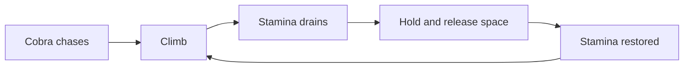

# Monkobra CONTEXT

## Project Overview

Monkobra is a 3D vertical upward-scrolling game: a monkey climbs an endless tree, chased by a cobra, and grabs bananas to restore stamina. It descends from a paired prototype (`kami-lel/usc-csci-526-paired-prototype`).

| Aspect | Value |
| --- | --- |
| Engine | Unity |
| Genre | 3D obstacle-running (*Temple Run 2*, *Subway Surfers*, *Minion Rush*) |
| Course | USC CSCI-526, Fall 2026 |
| Team | Yuqing Lu, Yangyi Lu (Erik) |

## Repository Layout

```text
monkobra/
├── .gitignore    Unity template ignore rules
├── README.md     human onboarding
├── AGENTS.md     agent rules
└── CONTEXT.md    this file
```

No Unity project files (`Assets/`, `ProjectSettings/`) are committed yet.

## Gameplay Model

Intended design, taken from the prototype document. Nothing is implemented in this repository yet.

| Element | Behavior |
| --- | --- |
| Monkey | held at screen center, moves up-down and left-right around the trunk (2.5D) |
| Tree | infinitely tall, with branches as obstacles and bananas hanging on branches |
| Cobra | chases from the bottom of the screen, touching it kills the monkey |
| Stamina | drains steadily while climbing, restored only by banana pickups |
| Branch hit | temporary dizziness |
| Grab | hold space to stretch the arm, release to trigger the pickup, hold time sets reach |



## Patterns & Conventions

- The core tension is escape vs. sustain: grabbing slows the monkey's reactions, so every pickup risks a branch or cobra collision
- Difficulty is expected to scale with distance climbed, as in the genre's other titles

## Known Gaps & Constraints

- No Unity project, scripts, scenes, or tests exist yet
- No build, run, or test commands are defined
- The prototype's WebGL link, gameplay video, and contributions belong to a different team's submission and do not describe this repository

## Living Document Maintenance

Update this file in the same change that adds entities, systems, or mechanics, or shifts boundaries or workflows. The assistant that made the change writes the update as its final step.
