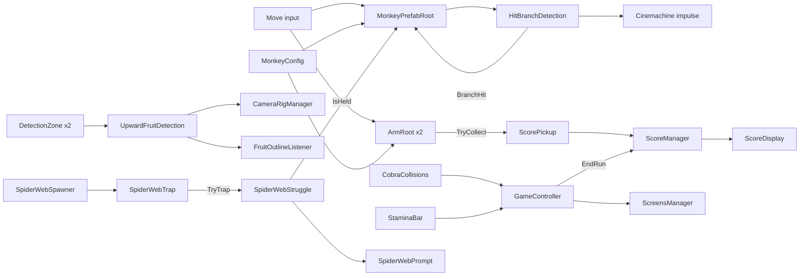

# Monkobra CONTEXT

Descriptive knowledge of this repository for agents and developers.

- Belongs Here: what the system is, ie architecture, domain model, API surface, patterns, known gaps; only what the code cannot show, as it stands, never its history
- Size: stay lean for the context window; when the file grows, move detail to `docs/` or cut it
- Upkeep: update in the same change that moves architecture, patterns, commands, or environment variables
- Structure: follow the existing sections; keep every statement true for every contributor
- Belongs in `AGENTS.md`: prescriptive rules for agents, ie commands, conventions, constraints, do/don't
- Belongs in `docs/`: system documentation for users and agents alike; link it from here, never grow this file to hold it
- Local Layer: put machine-specific or personal context in `CONTEXT.local.md`; create it if missing, never commit it

## Project Overview

Monkobra is a Unity course project (USC CSCI-526, Fall 2026) descended from a paired prototype (`kami-lel/usc-csci-526-paired-prototype`). Where each kind of knowledge lives:

| Topic | Home |
| --- | --- |
| Concept, pillars, mechanics, difficulty intent | [Game Design Document](docs/monkobra-gdd.md) |
| Stack, scenes, run lifecycle, monkey, tree, stamina, score, input, UI, conventions | [Technical Design Document](docs/monkobra-tdd.md) |
| Cobra, falling cobra, branches, spider webs, touch outcomes | [Mobs](docs/mob-doc.md) |
| Detection zones, reach, release check, camera swap, outlines | [Grab System](docs/grab-doc.md) |
| Controls, setup | [README](README.md) |
| Agent rules, WebGL export | [AGENTS.md](AGENTS.md) |

This file is the script index and the map of how the pieces connect. Behavior and numbers live in the documents above, never here.

## Repository Layout

```text
monkobra/
├── README.md          human onboarding
├── AGENTS.md          agent rules
├── CONTEXT.md         this file
├── CHANGELOG.md       version history, plus open triage tags in a comment
├── docs/              design, technical, mob, and grab documents
├── Assets/
│   ├── _Monkobra/     all authored assets, <Type>/<Module>/<asset>
│   │   ├── Scenes/    Lv1Scene (main), CobraDemo, FallingCobraDemo, WebDemo
│   │   ├── Scripts/   ArmRoot/, Cobra/, Environment/, Scoring/, UI/, GameController, GameConfig
│   │   ├── Prefabs/   Player/, Cobra/, Environment/, UI/
│   │   ├── Material/  Environment/, Player/
│   │   ├── Shaders/   Environment/FruitOutline (inverted-hull Shader Graph)
│   │   └── Settings/  tuning assets, Scoring/, _Shared/ URP assets and input actions
│   ├── TextMesh Pro/  imported TMP essentials, not authored
│   └── Readme.asset   Unity template leftover
├── Monkobra/          committed WebGL export served by GitHub Pages
├── Packages/          manifest & lock
└── ProjectSettings/   Unity project settings
```

The repository root is the Unity project root. `Library/`, `Temp/`, `Logs/`, `UserSettings/`, `*.csproj`, and `*.slnx` are ignored.

## How the Pieces Connect



## Script Index

All under `Assets/_Monkobra/Scripts/`. Each row names the owner of the detail.

| Script | Role | Detail |
| --- | --- | --- |
| `GameController`, `GameState` | singleton, owns the `GameState` machine: Tutorial, Playing, Lost | [TDD](docs/monkobra-tdd.md#run-lifecycle) |
| `GameConfig` | ScriptableObject of stamina tuning | [TDD](docs/monkobra-tdd.md#stamina) |
| `ArmRoot/MonkeyPrefabRoot` | kinematic body: orbit, climb, stun, `IsHeld` | [TDD](docs/monkobra-tdd.md#monkey-movement) |
| `ArmRoot/MonkeyConfig` | ScriptableObject of monkey tuning and input actions | [TDD](docs/monkobra-tdd.md#monkey-movement) |
| `ArmRoot/ArmRoot` | one arm: climb stroke, reach, release check | [Grab](docs/grab-doc.md#reach-and-release) |
| `ArmRoot/DetectionZone` | side-tagged trigger forwarding enter and exit | [Grab](docs/grab-doc.md#detection) |
| `ArmRoot/UpwardFruitDetection` | singleton, reachable and grabbable fruit | [Grab](docs/grab-doc.md#detection) |
| `ArmRoot/CameraRigManager` | swaps the three Cinemachine cameras | [Grab](docs/grab-doc.md#camera) |
| `Cameras/CameraLookUp` | on the behind camera: tilts the aim point up while climbing | none |
| `ArmRoot/HitBranchDetection` | branch sensor: raises `BranchHit`, shakes the camera | [Mobs](docs/mob-doc.md#hit-penalty) |
| `Environment/TreeManager` | singleton, tree `MinY` and `MaxY` | [TDD](docs/monkobra-tdd.md#tree) |
| `Environment/DynamicTreeSegmentPrefabRoot` | places branches on a segment | [Mobs](docs/mob-doc.md#placement) |
| `Environment/DTSPool` | on an empty base marker: instantiates the segments, then recycles the lowest segment over the top, restarting it, for an endless tree | [TDD](docs/monkobra-tdd.md#tree) |
| `Environment/BranchFruitPlacementConfig` | ScriptableObject of branch placement | [Mobs](docs/mob-doc.md#placement) |
| `Environment/BranchWithScriptRoot` | decides whether a branch bears a banana | [Grab](docs/grab-doc.md#fruit-supply) |
| `Environment/FruitOutlineListener` | two-tier banana outline | [Grab](docs/grab-doc.md#feedback) |
| `Environment/SpiderWebSpawner` | places webs on the trunk | [Mobs](docs/mob-doc.md#placement-1) |
| `Environment/SpiderWebTrap` | web prefab root with one deepened trigger box | [Mobs](docs/mob-doc.md#trap-and-escape) |
| `Environment/SpiderWebStruggle` | on the monkey: trap state, escape bar, immunity | [Mobs](docs/mob-doc.md#trap-and-escape) |
| `Environment/SpiderWebBuilder` | `Build Web` context menu that builds the web strands out of cubes, a one-off authoring aid | none |
| `Environment/WinZoneHandler` | empty leftover on `TreeTop`, win removed, to delete | [TDD](docs/monkobra-tdd.md#run-lifecycle) |
| `Cobra/CobraClimb` | chasing cobra path, coil, and look | [Mobs](docs/mob-doc.md#cobra) |
| `Cobra/CobraCollisions` | cobra contact calls `LoseGame` | [Mobs](docs/mob-doc.md#contact) |
| `Cobra/FallingCobraSpawner` | unlock, rhythm, and branch pick | [Mobs](docs/mob-doc.md#falling-cobra) |
| `Cobra/FallingCobra` | warning, fall, and hit capsule | [Mobs](docs/mob-doc.md#falling-cobra) |
| `Difficulty/RampedDifficultyService` | singleton, maps player y to a 0~1 ramped difficulty via an inspector curve | none |
| `Scoring/ScoreManager` | singleton, distance and reward score | [TDD](docs/monkobra-tdd.md#score) |
| `Scoring/ScoreConfig`, `Scoring/ScoreReward` | ScriptableObjects of score rules and pickup points | [TDD](docs/monkobra-tdd.md#score) |
| `Scoring/ScorePickup` | on a fruit: hands points over once | [Grab](docs/grab-doc.md#on-a-successful-grab) |
| `UI/StaminaBar` | singleton slider, drains, restores, empty slows monkey | [TDD](docs/monkobra-tdd.md#stamina) |
| `UI/ScreensManager`, `UI/ProgressBarRoot`, `UI/ScoreDisplay`, `UI/HeightDisplayController`, `UI/LoseScreenController` | tutorial and lose panels, climb progress, score label, climbed height label, final height and score on the lose panel | [TDD](docs/monkobra-tdd.md#ui) |
| `UI/SpiderWebPrompt` | first-trap hint and escape bar | [Mobs](docs/mob-doc.md#trap-and-escape) |

## Known Gaps & Constraints

Gaps that belong to one subsystem are listed in [Mobs](docs/mob-doc.md#known-gaps) and the [Grab System](docs/grab-doc.md#known-gaps). Project-wide ones:

- No tests or run commands exist: verification means opening `Lv1Scene` in the Editor
- `CobraDemo`, `FallingCobraDemo`, and `WebDemo` remain next to `Lv1Scene` as test scenes
- The tree is finite, not the endless tree of the pitch
- Broader difficulty scaling is not yet designed, see the [Game Design Document](docs/monkobra-gdd.md#difficulty)
- The prototype's WebGL link, gameplay video, and contributions belong to a different team's submission and do not describe this repository

## Living Document Maintenance

A stale briefing is worse than none. Update this file in the same pull request that adds, moves, or renames a script, or shifts how the pieces connect. The assistant that made the change writes the update as its final step, and the file stays on the pull-request checklist.
