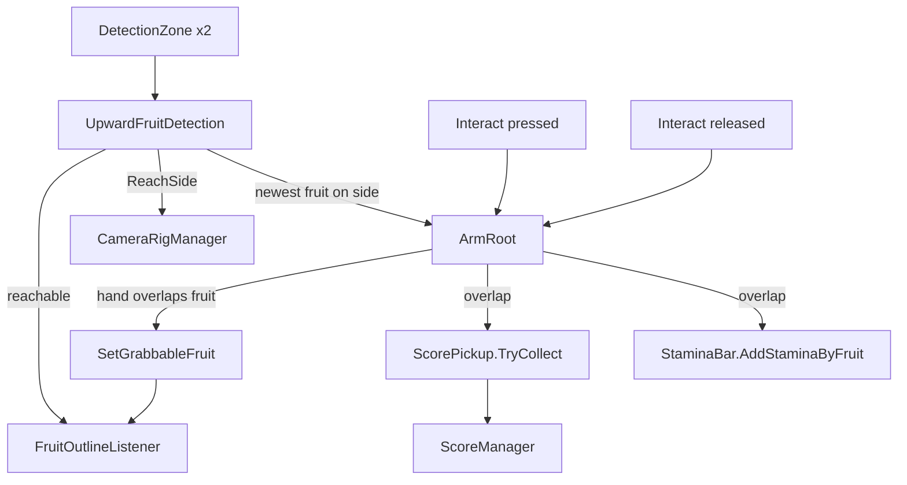

# Monkobra Grab System

How the monkey reaches for and picks bananas: the detection zones, the arm reach, the release check, the camera swap, and the feedback. Design intent is in the [Game Design Document](monkobra-gdd.md), the wider system map in the [Technical Design Document](monkobra-tdd.md), and what a web does to a reach in [Mobs](mob-doc.md#trap-and-escape).

## Flow

1. a banana enters a side's detection zone and becomes reachable
2. the player presses interact: the matching arm locks its aim at the newest banana on that side and the camera swings to that side
3. while interact is held the arm stretches along the locked line
4. on release, the grab succeeds only if the hand overlaps the banana at that instant

## Parts

| Script | Role |
| --- | --- |
| `ArmRoot/DetectionZone` | side-tagged trigger volume on the monkey that forwards enter and exit events |
| `ArmRoot/UpwardFruitDetection` | singleton (`I`) that keeps the reachable fruit per side, picks the reach side, and relays the grabbable fruit |
| `ArmRoot/ArmRoot` | one arm: hand-over-hand climb stroke, or the reach and the release check |
| `ArmRoot/MonkeyConfig` | reach speed, stroke tuning, and the interact action both arms and the camera read |
| `ArmRoot/CameraRigManager` | swaps the behind, look-left, and look-right Cinemachine cameras |
| `Environment/FruitOutlineListener` | two-tier outline on a banana |
| `Environment/BranchWithScriptRoot` | decides whether a branch bears a banana |
| `Scoring/ScorePickup` | on a fruit, hands its points to `ScoreManager` once and switches the fruit off |
| `UI/StaminaBar` | `AddStaminaByFruit` restores stamina on a grab |

## Detection

- Zones: two `DetectionZone` triggers (`LeftDetection`, `RightDetection`, under `Detections` on the monkey prefab) flank the monkey. Each forwards `Entered` and `Exited` with its side
- Filter: `UpwardFruitDetection` keeps only colliders tagged `FruitCollider`, in a set per side plus one entry-order list across both
- Reach Side: `ReachSide` is right only when the right zone has fruit and the left does not, else left, including when neither or both have fruit. Only the arm on that side reaches
- Newest Fruit: the target is the most recent entry on that side
- Reach Events: `FruitReachChanged` fires when a fruit enters or leaves both zones combined, so a fruit in the other zone still counts as reachable
- Reach Target: `ReachTarget` is the single fruit a reach would aim at, the newest on `ReachSide`, and `ReachTargetChanged` fires when it changes. While an arm reaches, `SetLockedTarget` pins it to the aimed fruit, so a newer fruit never steals the outline. Only that fruit is outlined
- Removal: a grabbed fruit is switched off inside a zone, where its trigger exit may never fire, so `RemoveFruit` clears it from both sides explicitly

## Reach and Release

`ArmRoot` has two modes on one `ConfigurableJoint`, and writes only the joint's drive targets, never its configuration.

- Climb Mode: while move input is held the arm sweeps a stroke, the two arms half a cycle apart, and the linear axis is locked
- Reach Mode: pressing interact on the matching side starts the reach. The aim is set once toward the fruit and then only stretches, at the configured speed, up to the joint's linear limit
- Release: `TryGrabFruit` runs on release. It does nothing if the game is paused or over. The grab succeeds only if `Physics.ComputePenetration` finds the hand collider overlapping the aimed fruit at that instant
- Miss: a release before the hand reaches the fruit, or after it stretched past, grabs nothing. The log names it as too short or too long. The arm then pulls back, and the cost is time spent exposed
- Grabbable Cue: while reaching, the arm reports the fruit under the hand through `SetGrabbableFruit`, so the outline can tell the player a release would grab it
- Hand Contacts: only collisions on the hand collider count as the hand's, and the arm ignores collisions with the body's own colliders

## On a Successful Grab

1. `ScorePickup.TryCollect` refuses if the game is over, paused, or the fruit was already collected. Otherwise it hands its reward to `ScoreManager` once and switches the fruit off. A fruit with no `ScorePickup` is just switched off
2. every collider of that fruit is removed from the detection sets
3. `StaminaBar.I.AddStaminaByFruit` restores stamina, capped at the maximum, and works from empty too

## Camera

`CameraRigManager` owns three Cinemachine cameras. The behind view is the default. While interact is held it switches to look-right if only the right side has fruit, else look-left, even with no fruit. Releasing returns to behind. A swap raises the chosen camera's priority above the other two and the `CinemachineBrain` on the main camera blends. If a web traps the monkey, the interact action is disabled, which counts as a release for the camera too.

## Feedback

`FruitOutlineListener` adds an extra material slot, using the `FruitOutline` inverted-hull Shader Graph, in two tiers:

| Tier | When | Priority |
| --- | --- | --- |
| Reachable | the fruit is `ReachTarget`, the one a reach would aim at | lower |
| Grabbable | a hand overlaps the fruit, so a release would grab it | higher, wins |

## Fruit Supply

Bananas come from branches, not their own spawner. `BranchWithScriptRoot` rolls once on `Awake` per branch: with the banana chance it keeps the banana and stem, scaling the stem between 0.5x and 2x and rotating the banana randomly, otherwise it disables both. Branch density by height is in [Mobs](mob-doc.md#placement).

## Tuning

| Setting | Value | Where |
| --- | --- | --- |
| Reach Extend Speed | 4 u/s | `Settings/MonkeyConfig.asset` |
| Max Reach | the joint's linear limit | `ConfigurableJoint` on the `Arm` prefab |
| Stamina Per Banana | 30, capped at the 100 maximum | `GameConfig` (default, not overridden in the asset) |
| Points Per Banana | 100 | `Settings/Scoring/BananaScore.asset` |
| Banana Chance Per Branch | 0.15 | `Prefabs/Environment/BranchWithFruit` |

## Known Gaps

- `ArmRoot` carries a fixme to split it into several systems
- A miss costs no stamina, only exposure
- Scenes without a `ScoreManager` restore stamina on a grab but score nothing, see [Score](monkobra-tdd.md#score)
