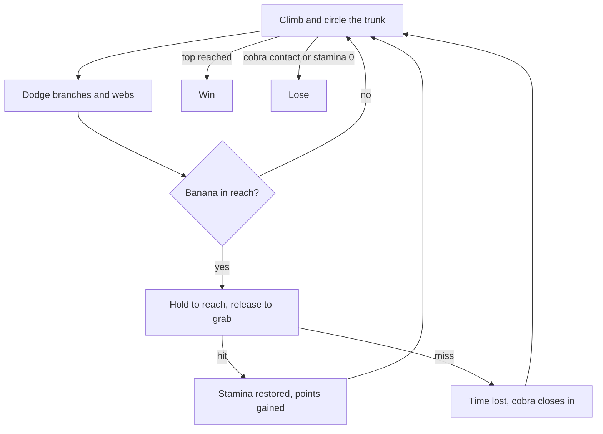

# Monkobra Game Design Document

Design intent for Monkobra: what the player does, why it is tense, and what makes it different. Technical detail lives in [CONTEXT.md](../CONTEXT.md), controls and setup in the [README](../README.md).

## Concept

Monkobra is a 3D vertical upward-scrolling game. You are a monkey climbing a very tall tree while a cobra chases you from below. On the way to the top you dodge branches and reach out an arm to pick bananas, which are the only way to keep your stamina from running dry.

- Genre: 3D obstacle-running, turned vertical
- Reference Games: *Temple Run 2*, *Subway Surfers*, *Minion Rush*
- Timing Reference: the hold-and-release reach borrows from *Gold Miner*
- Camera: monkey held at the center of view, tree and sky behind, swinging to a side view while the arm reaches
- Session: short runs, built for quick retries

## Design Pillars

- Pressure From Two Sides: the cobra climbs from below while stamina drains from within, so the player is never safe
- Earned Rewards: stamina comes only from a deliberate, timed grab, never from touching an item
- Risk Tied To Reward: every grab costs attention and exposes the monkey, so each banana is a gamble
- Readable Mistakes: the player can always tell why a run was lost, a late release, a branch, or a slow climb

## Genre Conventions

3D obstacle-running games share a set of tropes. Monkobra keeps most of them and changes how collecting works.

- Kept: constant pursuit, obstacles to dodge, penalties for collisions, success measured by distance, short replayable runs
- Changed: the character does not advance on its own, the player climbs, and the cobra supplies the forward pressure
- Replaced: passive pickup on contact is replaced by the grab, a skill action of its own

## Core Twist

The twist is **banana grabbing and stamina balancing**.

- Grab: hold the interact key to reach an arm toward a banana on a nearby branch, release at the right moment to pick it up
- Restore: a successful grab refills stamina by a large margin, offsetting the steady drain of climbing
- Balance: climbing costs stamina and grabbing takes focus away from dodging, so the player weighs escape against sustain

### Why It Matters

- Timing as a Skill: collection becomes a skill challenge, not a matter of positioning
- Stationary Vulnerability: the reach trades the genre's uninterrupted reflex sprint for a tense, exposed pause
- Three Demands at Once: escape (climb away from the cobra), sustain (grab bananas), and precision (time the release)

## Core Loop

## Resources and Pressures

- Stamina: the survival resource, drained by time and by movement, restored only by grabbing, and the run ends at zero
- The Cobra: a pressure that never relents, it climbs nonstop and ends the run on any contact
- Height: both the goal and the measure of progress, the canopy is the win condition
- Attention: the hidden resource, since every grab spends focus that dodging would otherwise use

## Mechanics

| Mechanic | Design Intent | Outcome |
| --- | --- | --- |
| Climb and Circle | free vertical movement and circling of the trunk, the main way to dodge | climbing costs the most stamina, circling less, descending none |
| Banana Grab | hold-and-release timing as its own skill check | a hit restores stamina and scores points, a miss wastes time |
| Branch Hit | punishes careless movement without ending the run | camera shake, brief loss of control, a drop down the trunk |
| Cobra Chase | constant pursuit from below, its coil wraps the trunk so orbiting or dropping into it is as fatal as being caught from behind | any contact with the cobra's body ends the run |
| Falling Cobra | a hazard from above that rewards watching the branches | warns, then falls, with the same penalty as a branch hit |
| Spider Web | a forced stop that lets the cobra gain ground, and a clash with the grab since reaching is locked while stuck | holds the monkey until rapid presses fill an escape bar, then brief immunity from further webs |
| Score | rewards height and risk | points per meter climbed and a bonus per banana grabbed |

## Win and Lose

- Win: the monkey reaches the top of the tree
- Lose: the cobra touches the monkey, or stamina reaches zero
- Result: either outcome ends the run and shows the final score

## Player Experience

The intended arc is steady tension broken by short bursts of risk. The player climbs while the stamina bar shrinks, spots a banana, and decides whether the pause is worth it. A clean grab feels like relief, and a mistimed one is paid for in cobra distance.

## Difficulty

- Ramp: branches grow denser higher up the tree, and spider webs appear only on the upper half
- Falling Cobra Ramp: once unlocked after a long climb, it drops more often the higher the monkey has climbed, down to a floor interval, even if the monkey later falls back. Numbers and scene status are in [Mobs](mob-doc.md#falling-cobra)
- Future Work: broader scaling, such as cobra speed or hazard frequency, is not yet designed
