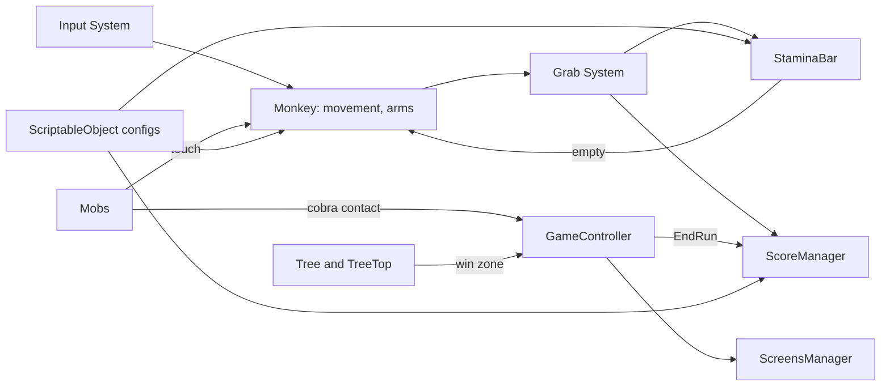
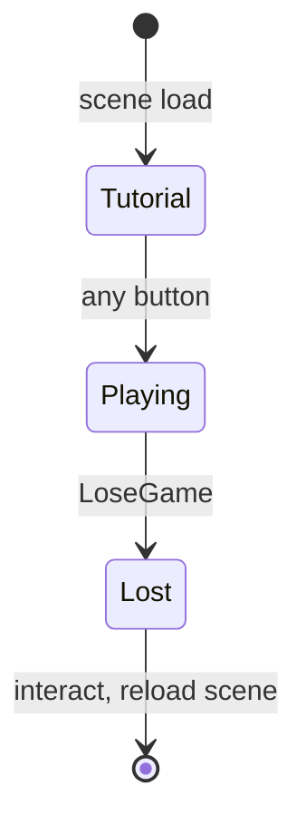

# Monkobra Technical Design Document

How Monkobra is built: the engine and packages, the run lifecycle, the systems that do not belong to one subsystem document, the conventions every script follows, and where to find the rest. Design intent is in the [Game Design Document](monkobra-gdd.md), controls and setup in the [README](../README.md), and the agent-facing system map in [CONTEXT.md](../CONTEXT.md).

## Document Map

| Document | Owns |
| --- | --- |
| [Game Design Document](monkobra-gdd.md) | what the player does and why: pillars, loop, mechanics, difficulty |
| This document | engine, architecture, run lifecycle, monkey, tree, stamina, score, UI, input, conventions |
| [Mobs](mob-doc.md) | cobra, falling cobra, branches, spider webs, and what each does when the monkey touches it |
| [Grab System](grab-doc.md) | detection zones, arm reach, release check, camera swap, outline feedback |
| [AGENTS.md](../AGENTS.md) | rules for agents, including the WebGL export steps |
| [CONTEXT.md](../CONTEXT.md) | descriptive system map and known gaps |
| [CHANGELOG.md](../CHANGELOG.md) | version history |

A system gets its own document when it spans several scripts and carries rules a reader cannot see from one file. Everything else stays here.

## Stack

| Aspect | Value |
| --- | --- |
| Engine | Unity 6 (`6000.3.22f1`) |
| Render Pipeline | URP 17.3.0, with a PC and a Mobile asset under `Settings/_Shared/` |
| Input | Input System 1.20.0 |
| Camera | Cinemachine 3.1.7 (view swaps, impulse shake) |
| UI | uGUI 2.0.0 with TextMesh Pro |
| Target | WebGL on GitHub Pages, built from the Editor |
| Tests | none yet, `com.unity.test-framework` is installed |

## Scenes

| Scene | Purpose |
| --- | --- |
| `Lv1Scene` | the game: the only scene in Build Settings |
| `CobraDemo` | test scene for the chasing cobra |
| `FallingCobraDemo` | test scene for the falling cobra, the only scene that has one |
| `WebDemo` | test scene for spider webs, no score |

The folder layout and a script-by-script index are in [CONTEXT.md](../CONTEXT.md#repository-layout).

## Architecture

Subsystems talk through scene singletons, C# events, and trigger callbacks, not through direct scene references. Details are in [Conventions](#conventions).

## Run Lifecycle

`GameController` is the scene singleton that owns the `GameState` machine, exposed as `State` with a `StateChanged` event. A run only loses, it never wins.

| State | Time Scale | Screen |
| --- | --- | --- |
| Tutorial | 0 | tutorial panel, any button starts the run |
| Playing | 1 | none, never paused |
| Lost | 0 | lose panel, interact reloads the scene after `restartInputDelay` |

`LoseGame` runs once, from Playing only: the cobra touches the monkey ([Mobs](mob-doc.md#contact)). It calls `ScoreManager.EndRun` so the score settles, then enters Lost. `ScreensManager` owns the panels: they start deactivated, and it shows the current state's panel in `Start` and on every `StateChanged`.

Gameplay that must stop outside a run checks both `Time.timeScale <= 0` and `GameController.State != GameState.Playing`. Current checkers: `ArmRoot.TryGrabFruit`, `ScorePickup`, `ScoreManager.CanScore`, `SpiderWebStruggle`.

## Monkey Movement

`MonkeyPrefabRoot` drives the body and `MonkeyConfig` holds every number.

- Body: kinematic, with gravity off. The script writes position and rotation outright through the Rigidbody, so no arm joint or collision can push it off its path
- Orbit: the horizontal input changes one angle, and the body sits exactly on a ring of fixed radius round its parent, the trunk
- Climb: the vertical input ramps a climb speed along world Y with separate acceleration and deceleration, and different maximums up and down
- Held: `IsHeld` freezes the body in place, set by the web trap ([Mobs](mob-doc.md#trap-and-escape))
- Stun: after a branch hit the input is ignored and the body falls a set distance ([Mobs](mob-doc.md#hit-penalty))
- Stamina Cost: each step reports upward and sideways distance to `StaminaBar.DrainByMovement`. The stun fall and descending cost nothing

| Setting | Value |
| --- | --- |
| Climb Speed Up | 6 u/s |
| Climb Speed Down | 12 u/s |
| Orbit Speed | 50 deg/s |
| Acceleration | 20 u/s² |
| Deceleration | 30 u/s² |

All values come from `Settings/MonkeyConfig.asset`. The arm stroke and reach tuning in the same asset is covered by the [Grab System](grab-doc.md#tuning).

## Tree

The tree is a stack of static and dynamic trunk segments under a `TreeTop`.

- Extent: `TreeManager` (singleton `I`) holds the tree's `MinY` and `MaxY`, 0 and 100 by default, and everything that maps a height to progress reads it: branch density, web start, the progress bar. The tree is finite
- Segments: each `DynamicTreeSegmentPrefabRoot` places branches on itself in `Start` ([Mobs](mob-doc.md#placement)), and `SpiderWebSpawner` places webs after that ([Mobs](mob-doc.md#placement-1))
- Pool: `DTSPool` sits on an empty object, finds the `Player`-tagged object once, and instantiates `segmentCount` copies of `segmentPrefab` end to end, the first (lowest) one created at the world height `firstSegmentY`. It keeps them in a FIFO: only when the stack top is less than `lookAheadU` above the player, and the lowest segment lies wholly under the player, that lowest one is moved over the stack top by `DynamicTreeSegmentPrefabRoot.Restart`, which clears its branches and webs and rolls branches again; `SpiderWebSpawner.PopulateSegment` then redoes the webs. Its `mockTree` field names an editor-only stand-in that is deactivated at runtime
- Top: the `TreeTop` prefab carries the win zone

## Stamina

`StaminaBar` is a singleton `Slider` that reads `GameConfig`.

- Timer Drain: a fixed amount every interval, as a coroutine started in `Start`
- Movement Drain: `DrainByMovement` per physics step, upward distance costs more than sideways
- Restore: `AddStaminaByFruit` adds the per-banana amount, capped at the maximum ([Grab System](grab-doc.md#on-a-successful-grab))
- Idle Recovery: `MonkeyPrefabRoot` adds `MonkeyConfig.IdleStaminaRecoveryPerS` per second while no move key is pressed
- Depletion: reaching 0 does not end the run: `MonkeyPrefabRoot` scales upward climb speed only by `MonkeyConfig.ExhaustedSpeedMultiplier` (0.2) until stamina is above 0 again

| Setting | Value | Note |
| --- | --- | --- |
| Max Stamina | 100 | asset |
| Timer Drain | 10 per 10 s | asset |
| Restore Per Banana | 30 | script default |
| Upward Cost | 0.5 per u | script default |
| Sideways Cost | 0.3 per u | script default |

All values live in `Settings/GameConfig.asset`. The fields the asset does not list take their script defaults.

## Score

`ScoreManager` (singleton `I`, on the `GameController` object) keeps two scores and notifies the UI when the total changes.

- Distance Score: whole meters of the highest point climbed times points per meter. Only a new high counts, so falling and re-climbing earns nothing
- Reward Score: points from each banana collected through its `ScorePickup`
- Gate: `CanScore` is true only after start, before `EndRun`, while unpaused, and while the game is not over
- Display: `ScoreDisplay` shows the total on the HUD and on the lose panel

| Setting | Value | Asset |
| --- | --- | --- |
| Points Per Meter | 1 | `Settings/Scoring/ScoreConfig.asset` |
| World Units Per Meter | 0.1 | 〃 |
| Points Per Banana | 100 | `Settings/Scoring/BananaScore.asset` |

`WebDemo` and the other test scenes have no `ScoreManager`.

## Camera

Three Cinemachine cameras (behind, look-left, look-right) are swapped by priority, and a shake comes from a Cinemachine impulse source on the branch sensor. The swap rules are in the [Grab System](grab-doc.md#camera), the shake trigger in [Mobs](mob-doc.md#hit-penalty).

## Input

One asset, `Settings/_Shared/InputSystem_Actions`, holds all bindings, referenced through `InputActionReference` fields. The keys and buttons are listed under Controls in the [README](../README.md#controls).

- Move: shared by the body and both arms through `MonkeyConfig`
- Interact: the grab, read by both arms and the camera rig
- Jump: the web escape press, read by `SpiderWebStruggle`
- Collision: Space is bound to both Interact and Jump, so the struggle disables interact while the monkey is trapped

## UI

| Element | Script | Shows |
| --- | --- | --- |
| Stamina Bar | `UI/StaminaBar` | current stamina |
| Climb Progress | `UI/ProgressBarRoot` | the monkey's height as a share of the tree, with a cobra marker |
| Score | `UI/ScoreDisplay` | total score, on the HUD and the lose panel |
| Screens | `UI/ScreensManager` | tutorial and lose panels |
| Web Prompt | `UI/SpiderWebPrompt` | first-trap hint and the escape bar ([Mobs](mob-doc.md#trap-and-escape)) |

## Conventions

- Singletons: scene-scoped and first-wins. `TreeManager`, `UpwardFruitDetection`, `StaminaBar`, and `ScoreManager` destroy a duplicate component only. `GameController` and `ScreensManager` destroy the duplicate's whole GameObject
- Start Over Awake: a consumer that may start before its singleton reads it in `Start`, so Awake order never matters
- Events Over Calls: detection scripts forward trigger events (`Entered`, `Exited`, `BranchHit`) rather than calling their consumers
- Tags: `Branch`, `FruitCollider`, and `Player` drive trigger matching. Webs match by a Rigidbody component instead
- Tuning In Data: values stay in serialized fields, and shared tuning sits in a ScriptableObject (`MonkeyConfig`, `GameConfig`, `ScoreConfig`, `ScoreReward`, `BranchFruitPlacementConfig`). Gameplay values are never hard-coded
- Field Guards: required inspector fields are checked in `Awake` with a logged message naming the field
- Kinematic Body: nothing about the monkey is mass or gravity driven. Each arm is posed purely by its joint drives
- Style: `ArmRoot/`, `GameController`, `GameConfig`, `UI/StaminaBar`, `UI/ScreensManager`, `Cobra/CobraClimb`, `Cobra/CobraCollisions`, and most of `Environment/` follow the house Unity style. `Scoring/`, `Cobra/FallingCobra`, `Cobra/FallingCobraSpawner`, and `Environment/SpiderWebBuilder` are still in the template style, some with Chinese comments

## Build and Deploy

The only build is the WebGL export made from the Editor into `Monkobra/` and committed. Compression is disabled and the Default template is used, because GitHub Pages cannot set response headers. The steps and the required Player Settings are in [AGENTS.md](../AGENTS.md#github-pages-webgl-build).

## Known Gaps

Project-wide gaps are in [CONTEXT.md](../CONTEXT.md#known-gaps--constraints), subsystem ones in [Mobs](mob-doc.md#known-gaps) and the [Grab System](grab-doc.md#known-gaps).
